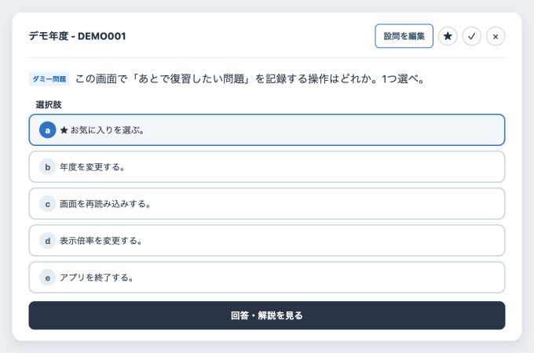
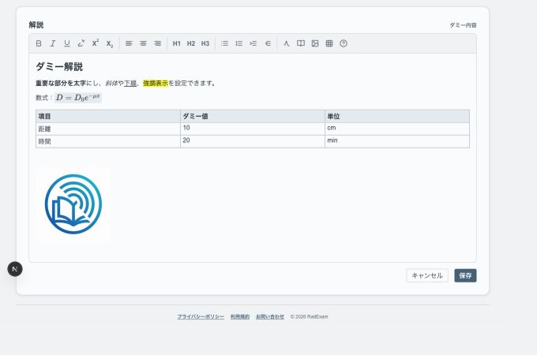

# RadExam

RadExamは、放射線科関連の専門医試験問題を登録・整理し、Mac、Windows、スマートフォン、タブレットで演習するためのアプリです。

問題、解説、学習履歴などのデータ本体は各端末内に保存されます。クラウド同期を使用しない限り、インターネット接続なしで利用できます。

> このリポジトリと配布アプリには試験問題や試験PDFは含まれていません。利用者自身が、試験問題PDFを入手し、個人の利用する範囲内でアプリに登録してご利用ください。

## 主な機能

- PDFから試験・問題を登録し、問題文、選択肢、正答、画像、解説を編集
- 年度、ジャンル、正誤、お気に入りなどによる問題の絞り込み
- 正誤履歴、お気に入り、中断位置の端末内保存
- 解説文の書式設定、数式・テーブル・画像の挿入、ジャンルの編集
- `.radexam`ファイルによるバックアップ・端末間移行
- Google DriveまたはOneDriveを使った任意の端末間同期
- ライト、ダーク、端末設定連動の表示モード
- 表示サイズの調節

### 問題演習画面の例

### 解説の編集の例

解説では、見出し、太字、斜体、下線、強調表示、上付き・下付き文字などの書式を設定でき、リスト、番号付きリスト、数式、テーブル、画像も挿入できます。

また他の問題の解説文を検索してコピー・ペーストすることもできます。

## 試験PDFから問題を登録する

PDF登録はMac/PC版の機能です。過去問PDF内の文字、配置、埋め込み画像を読み取り、問題文・選択肢・画像を問題ごとに整理した演習データを作成します。元のPDFも参照用として端末内に保存されます。

対応している試験は、放射線科専門医試験、放射線診断専門医試験、放射線治療専門医試験、核医学専門医試験、IVR専門医試験です。

1. 「試験管理」の「試験データインポート」を開きます。
2. 登録する試験の種類を選びます。
3. 「PDFファイルを選択」または「PDFフォルダを選択」からPDFを指定します。同じ試験であれば、1年度分だけでも、複数年度分をまとめても登録できます。
4. アプリが年度、問題番号、問題文、選択肢、画像を解析します。核医学専門医試験では、問題文中の別紙番号と巻末の図ページも対応付けます。
5. 解析後の問題一覧で、年度、問題文、選択肢、画像の対応を確認します。画像が不足している場合は、この画面から問題ごとに追加できます。
6. 新しい試験として登録するか、登録済みの同じ試験へ年度を追加するかを選び、「この内容で保存」を押します。

PDFの文字情報やレイアウトは試験の種類によって異なるため、登録時にはどの試験を登録するかを選択することで、専用の解析アルゴリズムを実行します。**解析アルゴリズムは、2021年度から2025年度（IVR専門医試験は2024年度）までのデータを使用して作成したものです。それ以前あるいは以降の年度の登録では動作確認を行っていないため、必ずしも正確に登録できるかは保証できません。**

また、自動解析ですべてを完全に再現できるとは限りません。問題の抜け、文章の混在、選択肢や画像の対応を保存前に確認してください。保存後もMac/PC版の問題演習画面から問題文、選択肢、画像、正答、解説を編集できます。

PDFの解析と登録は端末内で行われます。クラウド同期を利用者が実行しない限り、PDFや登録データがこの機能によって外部へ送信されることはありません。

## 対応端末の種類

| 版 | 対応端末 | 主な用途 |
| --- | --- | --- |
| Mac/PC版 | macOS、Windows | PDF取込、試験・問題の登録と編集、問題演習 |
| モバイル版（PWA） | iPhone、iPad、Android | Mac/PC版で作成したデータの演習、解説・ジャンル編集 |

モバイル版では、PDFからの新規試験作成や問題文・選択肢・画像の編集は行いません。登録済みの参照PDFは表示できます。

## Mac/PC版のインストール

[GitHub Releases](https://github.com/ywurij/RadExam/releases)から、お使いの端末に合うファイルをダウンロードします。

| 端末 | 選ぶファイル |
| --- | --- |
| Apple Silicon Mac（M1以降） | `RadExam-*-macOS-Apple-Silicon.dmg` |
| Intel Mac | `RadExam-*-macOS-Intel.dmg` |
| Windows（通常はこちら） | `RadExam-*-Windows-Installer-x64.exe` |
| Windows（インストール不要） | `RadExam-*-Windows-Portable-x64.exe` |

### macOS

1. DMGを開き、RadExamをApplicationsフォルダーへドラッグします。
2. ApplicationsからRadExamを起動します。
3. 未公証版で警告が出た場合は、FinderでControlキーを押しながらRadExamをクリックして「開く」を選びます。または「システム設定」→「プライバシーとセキュリティ」から起動を許可します。

### Windows

Installer版は通常のアプリとしてインストールされ、スタートメニューなどから起動できます。通常、こちらをご利用ください。

現在の配布物はコード署名されていないため、macOSやMicrosoft Defender SmartScreenの警告が表示される場合があります。必ず公式GitHub Releasesから取得したファイルだけを使用してください。

## iPhone・iPad・Androidへの導入

モバイル版はPWA（プログレッシブWebアプリ：Webサイトをネイティブアプリのように使える技術）として、次のURLで配信しています。

**[RadExam モバイル版を開く](https://rad-exam.vercel.app/)**

- iPhone / iPad: Safariの共有メニューから「ホーム画面に追加」を選択
- Android: Chromeのメニューから「アプリをインストール」または「ホーム画面に追加」を選択

クラウド同期は任意です。同期を使わない場合、問題データ、回答履歴、お気に入り、解説などはモバイル端末内の保存領域で処理され、通常の問題演習はインターネット接続なしで完結します。初回アクセス、アプリの更新、クラウド同期を行うときはインターネット接続が必要です。

## 基本的な使い方

1. Mac/PC版の「試験管理」からPDFを取り込み、試験名、年度、問題内容を確認します。
2. ホーム画面で試験、年度、ジャンル、出題数などを選んで演習を開始します。
3. 回答後に正誤、お気に入り、解説、ジャンルを記録します。
4. 「データ管理 / バックアップ」から、定期的に`.radexam`バックアップを書き出します。
5. 別端末へ移す場合は、バックアップを読み込むか、端末間共有でクラウド同期を使用します。

アプリ内の「使い方」ページにも、各画面の操作方法があります。

## データ保存とクラウド同期

- データ本体は常に各端末内へ保存され、オフラインでも演習・編集できます。
- Google DriveまたはOneDriveのアプリ専用領域へ、利用者の操作で変更を送受信できます。
- 同時に接続するクラウドは1サービスだけです。
- クラウド暗号化を有効にした場合、同じ同期パスフレーズがないと別端末で復元できません。
- クラウド同期はバックアップの代わりではありません。緊急復旧用の`.radexam`ファイルも保管してください。

クラウド同期を使わない場合、GoogleまたはMicrosoftアカウントへの接続は不要です。

## 更新時の注意

更新前に`.radexam`バックアップを保存してください。通常、Mac/PC版は新しいInstallerまたはDMGを使って更新でき、端末内データは維持されます。

Releaseに含まれる`SHA256SUMS.txt`は、ダウンロードした配布ファイルが破損・改変していないか確認するための上級者向け情報です。通常のインストールには不要です。

## 利用条件

RadExamのソースコードは[MIT License](LICENSE)で公開しています。依存パッケージや第三者が権利を持つ素材には、それぞれのライセンスが適用されます。利用者がアプリへ登録する試験問題、PDF、画像等の権利がMIT Licenseへ移ることはありません。

- [プライバシーポリシー](https://rad-exam.vercel.app/privacy)
- [利用規約](https://rad-exam.vercel.app/terms)
- [お問い合わせ](https://rad-exam.vercel.app/contact)
